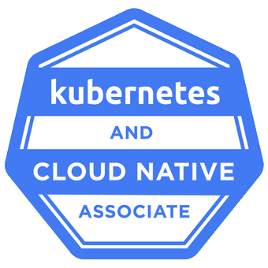
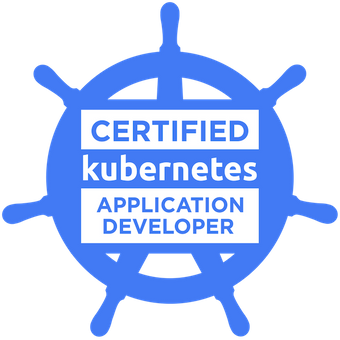
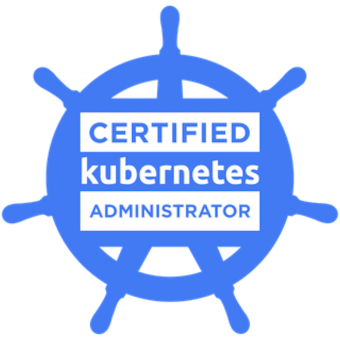
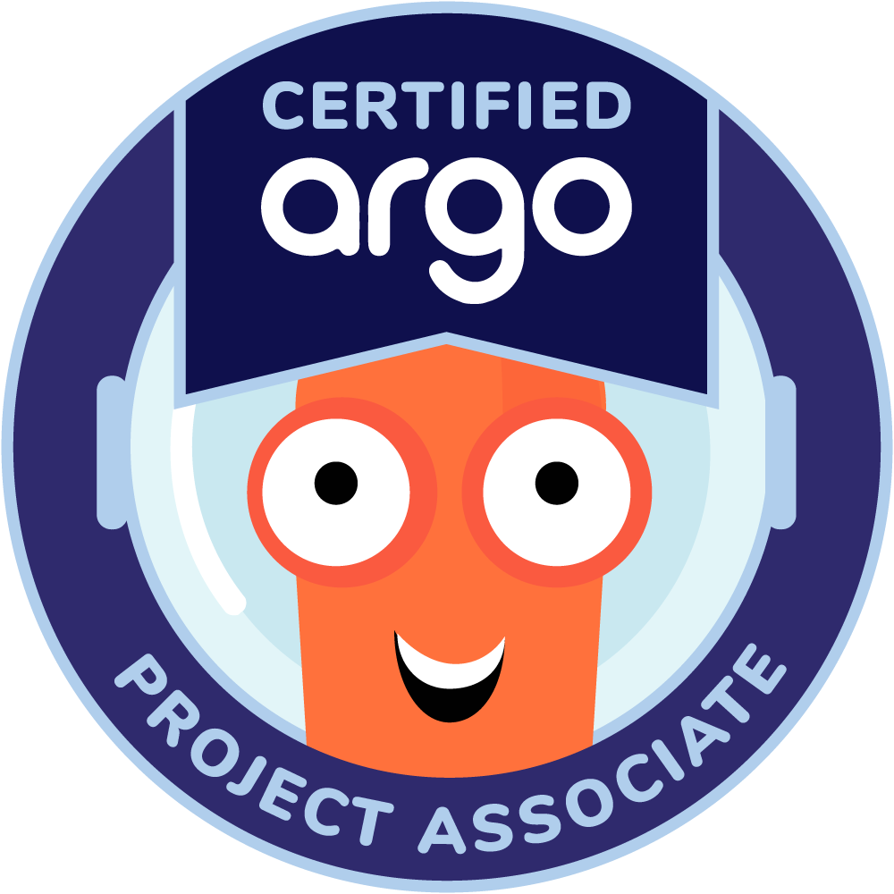
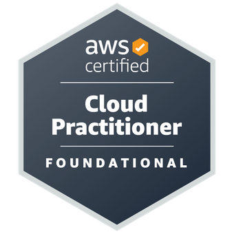

<h1 align="center">Hi 👋, I'm Yeray</h1>
<h3 align="center">A passionate CI/CD Engineer living in Germany</h3>

- 🌱 I’m currently targeting **the Kubestronaut certificaiton**

## Areas of Interest
  <!-- infrastructure -->
  
  
  
  
  
  
  <!-- monitoring -->
  
  
  
  <!-- git gud -->
  
  
  
  
## Certifications
### Kubernetes

  
  
  

### GitOps

  
  
  
  
  

### Cloud Providers

  

