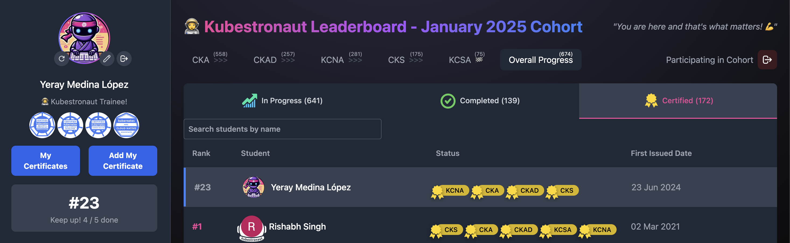
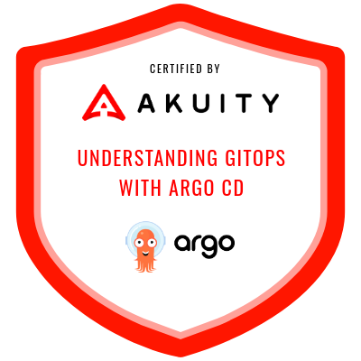
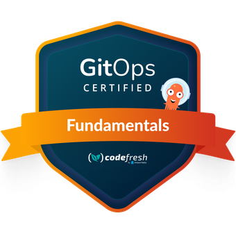
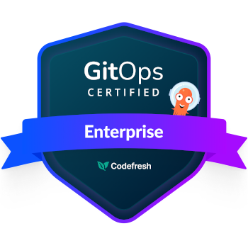

<h1 align="center">Hi 👋, I'm Yeray</h1>
<h3 align="center">A passionate Spanish IT professional based in Germany 🚀</h3>

With a strong focus on cloud-native technologies, DevOps practices, and automation, I specialize in building scalable and reliable infrastructures. My expertise spans Kubernetes, Terraform, and AWS, combined with a keen interest in GitOps and modern monitoring solutions.

🌟 **2025 Goal:** I’m currently targeting the [Kubestronaut certification](https://www.cncf.io/training/kubestronaut/).  

## Areas of Interest

  
  
  

  
  
  
  
  
  
  
  

  
  
  

    
    
  

  
  

  
## Certifications

### DevOps & CI/CD:

  
  
  

  
  
  
  
  

### Cloud Platforms

  

  

  

### Programming Languages

  

